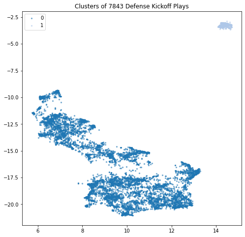
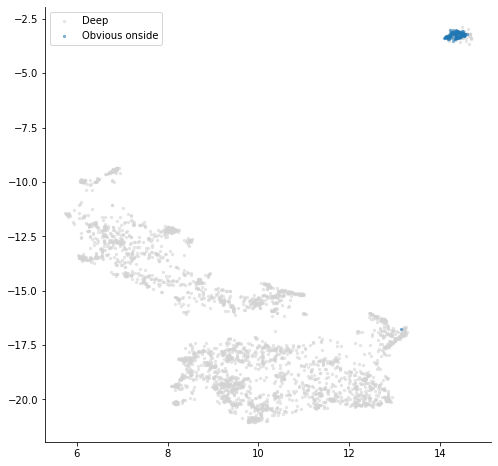
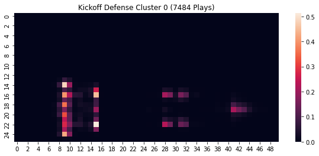
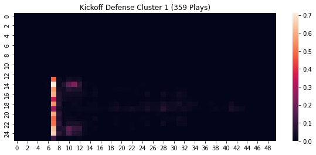

The `formation-clustering.ipynb` notebook walks through steps to clster player formations in NFL tracking data. The notebook was insipired by the Big Data Bowl competition hosted by Kaggle and can be found [here](https://www.kaggle.com/kevinarvai/formation-clustering).

# Kickoff Play Clusters

# Kickoff Play Clusters -- Onside Kick Labeled

# Kickoff Play Mean Play -- Cluster 0

# Kickoff Play Mean Play -- Cluster 1
